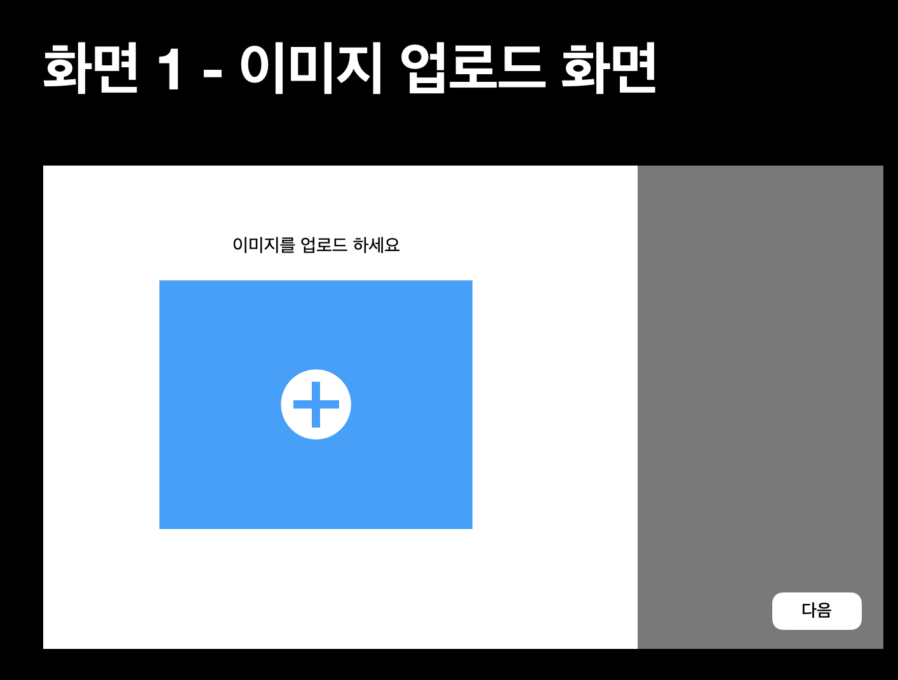
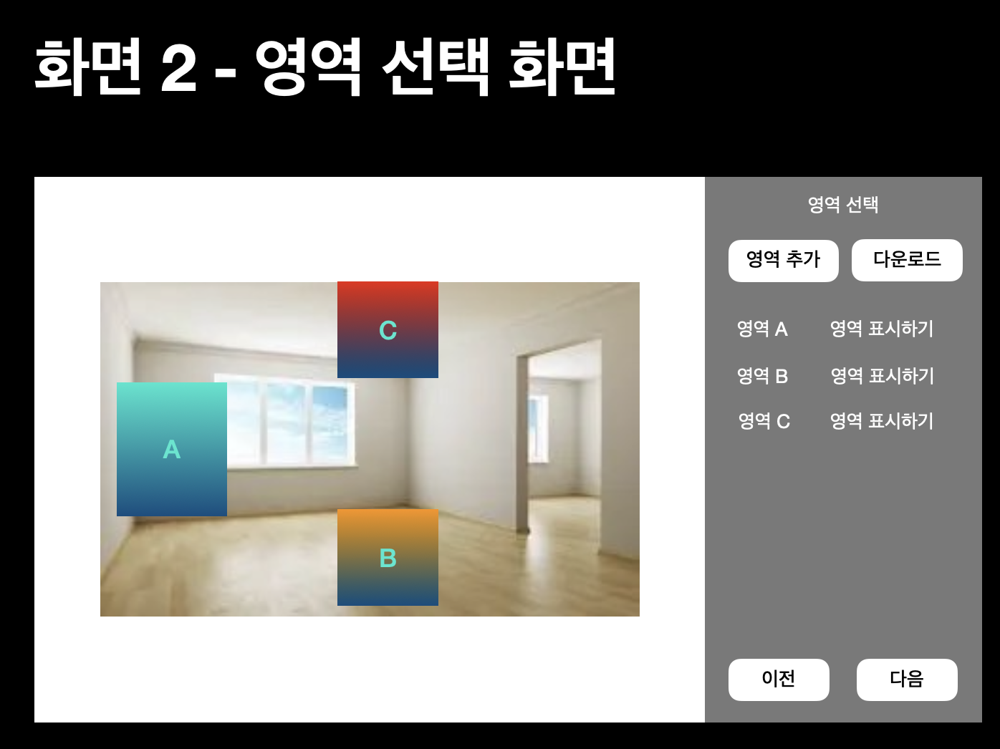
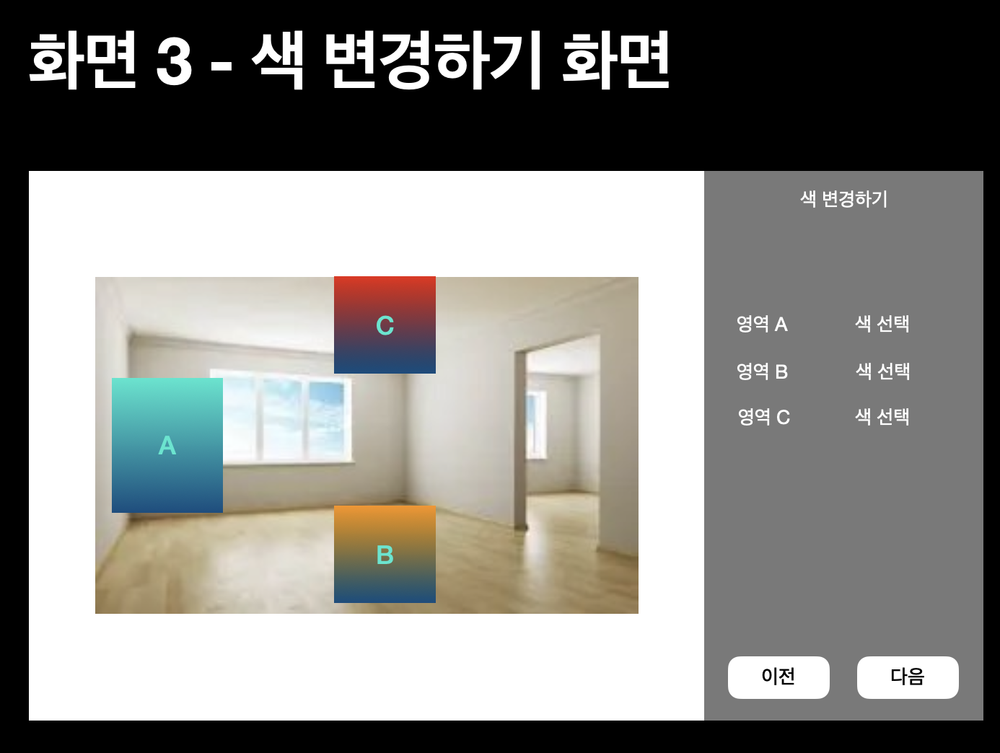
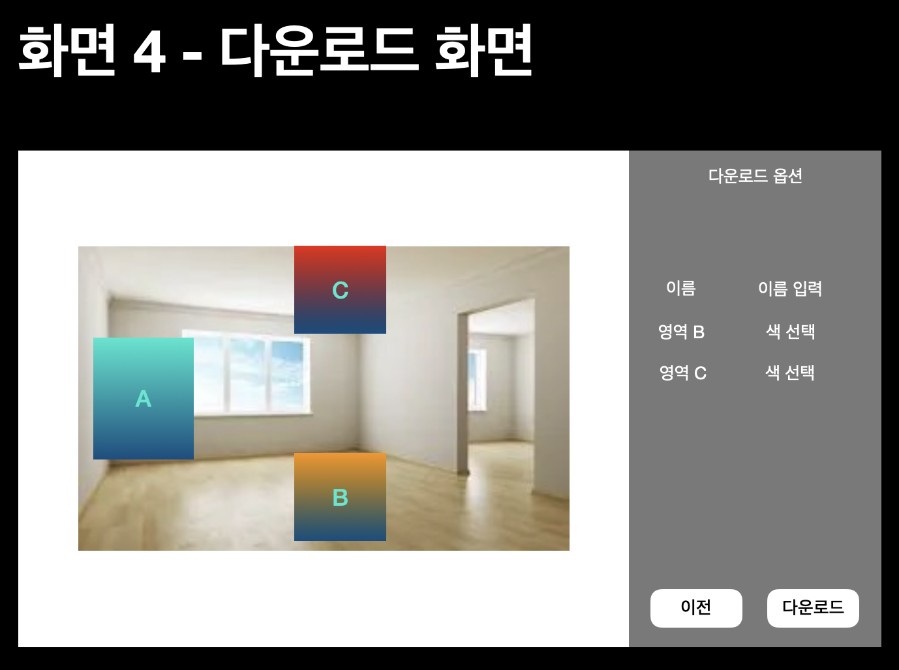

## 프로젝트 관련 간단한 소개

이번 프로젝트는 웹으로 이미지를 업로드하고, 업로드된 이미지에 간단한 구획을 추가하고, 설정한 구획의 색상을 변경할 수 있는 서비스입니다.

## 서비스 단계 설명
### 1. 이미지 업로드

설정을 원하는 이미지를 업로드 할 수 있음

### 2. 이미지 마커 설정

이미지 내에 마커를 설정할 수 있음

### 3. 이미지 조작

마커를 조작해서 이미지 내의 색을 변경할 수 있음

### 4. 이미지 다운로드

조작된 이미지를 다운로드 할 수 있음
